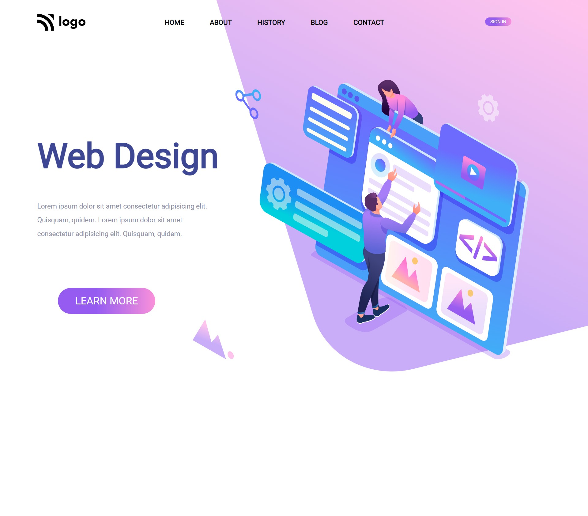

# Web-Design(Responsive)
## **HTML** **CSS**

### By making this project i learnt lot about tailwind and dynamic nature of css.

### Time Required Around **5hrs**
 
### [Here Deployed Link of Project]()

### Here **Screen-shot** of my project

# My other Websites

Here my portfolio websites 

- [Findcoder.in](https://www.findcoder.io/u/raavan)